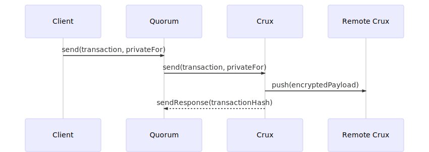
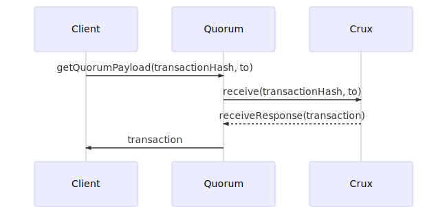

# Crux 

<a href="https://clh7rniov2.execute-api.us-east-1.amazonaws.com/Express/" target="_blank" rel="noopener"></a>
<a href="https://travis-ci.org/blk-io/crux/"></a>
<a href="https://goreportcard.com/report/github.com/blk-io/crux"></a>

Data privacy for Quorum. 

Crux is a secure enclave for Quorum written in Golang. 

It is a replacement for [Constellation](https://github.com/jpmorganchase/constellation/), the 
secure enclave component of [Quorum](https://github.com/jpmorganchase/quorum/), written in Haskell. 

## Getting started

### 4-node Quorum network with Crux

The best way to start is to run the 
[Quorum-Crux Docker image](https://github.com/blk-io/crux/tree/master/docker/quorum-crux). This 
image runs a 4 node Quorum network using Crux as the secure enclave communicating over gRPC. 

```bash
git clone https://github.com/blk-io/crux.git
docker-compose -f docker/quorum-crux/docker-compose.yaml up
```

Where the node details are as follows:

| Name    | Quorum node address     | Account key                                | Crux node key                                |
| ------- | ----------------------- | ------------------------------------------ | -------------------------------------------- |
| quorum1 | http://localhost:22001 | 0xed9d02e382b34818e88b88a309c7fe71e65f419d | BULeR8JyUWhiuuCMU/HLA0Q5pzkYT+cHII3ZKBey3Bo= | 
| quorum2 | http://localhost:22002 | 0xca843569e3427144cead5e4d5999a3d0ccf92b8e | QfeDAys9MPDs2XHExtc84jKGHxZg/aj52DTh0vtA3Xc= |
| quorum3 | http://localhost:22003 | 0x0fbdc686b912d7722dc86510934589e0aaf3b55a | 1iTZde/ndBHvzhcl7V68x44Vx7pl8nwx9LqnM/AfJUg= |
| quorum4 | http://localhost:22004 | 0x9186eb3d20cbd1f5f992a950d808c4495153abd5 | oNspPPgszVUFw0qmGFfWwh1uxVUXgvBxleXORHj07g8= |

### 2-node Crux only-network

[2 Crux nodes example](https://github.com/blk-io/crux/tree/master/docker/crux) is simple Docker 
image to just bring up 2 Crux nodes which communicate with each other.

```bash
git clone https://github.com/blk-io/crux.git
docker-compose -f docker/crux/docker-compose.yaml up
```

Where the Crux node keys are the same as `quorum1` and `quorum2` above, and are listening on ports 
9001 and 9002 for gRPC requests. 

### Vagrant VM

For those of you who are unable to use Docker, you can run the  
[7 Nodes Quorum example](https://github.com/blk-io/quorum-examples) which is an updated version 
of JP Morgan's Quorum 7 Nodes example using Crux as the secure enclave.

### Download the latest binary

The latest binaries for different platforms are available on the 
[release](https://github.com/blk-io/crux/releases/latest) page.

## Generating keys

Each Crux instance requires at least one key-pair to be associated with it. The key-pair is used 
to ensure transaction privacy. Crux uses the [NaCl cryptography library](https://nacl.cr.yp.to/).

You use the `--generate-keys` argument to generate a new key-pair with Crux:

```bash
crux --generate-keys myKey
```

This will produce two files, named `myKey.key` and `myKey.pub` reflecting the private and public keys 
respectively.

## Core configuration

At a minimum, Crux requires the following configuration parameters. This tells the Crux instance 
what port it is running on and what ip address it should advertise to other peers.

Details of at least one key-pair must be provided for the Crux node to store requests on behalf of.  

```bash
crux --url=http://127.0.0.1:9001/ --port=9001 --workdir=crux --publickeys=tm.pub --privatekeys=tm.key --othernodes=https://127.0.0.1:9001/
```

## Build instructions

If you'd prefer to run just a client, you can build using the below instructions and run as per 
the below.

```bash
git clone https://github.com/blk-io/crux.git
cd crux
make setup && make
./bin/crux

Usage of ./bin/crux:
      crux.config              Optional config file
      --alwayssendto string    List of public keys for nodes to send all transactions too
      --berkeleydb             Use Berkeley DB for working with an existing Constellation data store [experimental]
      --generate-keys string   Generate a new keypair
      --grpc                   Use gRPC server (default true)
      --grpcport int           The local port to listen on for JSON extensions of gRPC (default -1)
      --othernodes string      "Boot nodes" to connect to to discover the network
      --port int               The local port to listen on (default -1)
      --privatekeys string     Private keys hosted by this node
      --publickeys string      Public keys hosted by this node
      --socket string          IPC socket to create for access to the Private API (default "crux.ipc")
      --storage string         Database storage file name (default "crux.db")
      --tls                    Use TLS to secure HTTP communications
      --tlsservercert string   The server certificate to be used
      --tlsserverkey string    The server private key
      --url string             The URL to advertise to other nodes (reachable by them)
  -v, --v int                  Verbosity level of logs (shorthand) (default 1)
      --verbosity int          Verbosity level of logs (default 1)
      --workdir string         The folder to put stuff in (default: .) (default ".")
``` 

## How does it work?

At present, Crux performs its cryptographic operations in a manner identical to Constellation. You 
can read the specifics [here](https://github.com/jpmorganchase/constellation/#how-it-works). 

The two main workflows for handling private transactions are the submission and retrieval 
demonstrated below.

### New transaction submission



### Existing transaction retrieval



## Logical architecture


## Why Crux?

*Crux is a constellation located in the southern sky in a bright portion of the Milky Way. It is 
among the most easily distinguished constellations, even though it is the smallest of all 88 
modern constellations. (Source: [Wikipedia](https://en.wikipedia.org/wiki/Crux))*

*The critical or transitional moment or issue, a turning point.*

## Thanks

[@patrickmn](https://github.com/patrickmn) the original author of Constellation. Crux would not 
exist were it not for his work.
